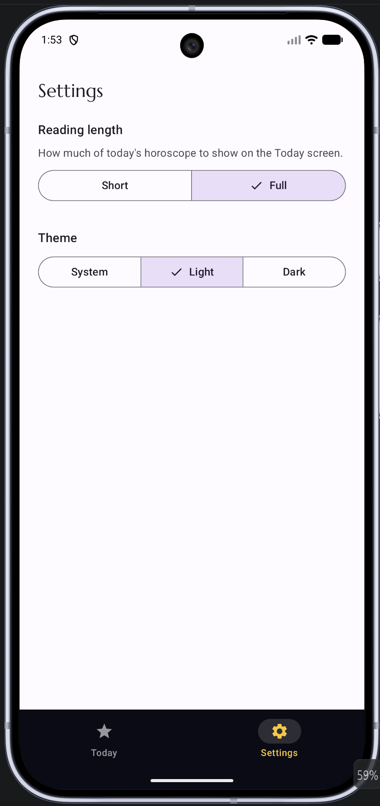

# Daily Star

A daily-companion Android app: set your birth date once, then open the app any day to see **today's** age, your **zodiac sign**, and a **live daily horoscope** fetched from a public API.

Built for **CP3406 Mobile Computing — Assignment 1 (Utility App)** at James Cook University.

## Screenshots

_Coming soon._

<!-- TODO: add 2–4 PNGs to docs/screenshots/ and embed them here, e.g.:
| Today screen | Settings screen |
|---|---|
|  |  |
-->

## Features

- **At-a-glance daily value** — pick your birth date once and the Today screen shows your current age (years / months / days), your zodiac sign, and a fresh horoscope for the current day.
- **Live horoscope** — the daily reading is fetched over the network from a public horoscope API, with inline loading and error states.
- **Settings that change the screen** — a *reading length* control (Short / Full) that immediately changes how much of the horoscope is shown on the Today screen.
- **Two-screen navigation** — a Material 3 bottom navigation bar switches between **Today** and **Settings**.

## Architecture

The app follows a layered **MVVM + Repository** architecture with dependency injection, so each layer has a single responsibility: composables never touch networking, view models never touch Compose, and the repository is the single source of truth for horoscope data.

```
com.example.issac/
├── MainActivity.kt              // thin entry point (@AndroidEntryPoint)
├── IssacApplication.kt          // @HiltAndroidApp
├── UtilityApp.kt                // Scaffold + bottom navigation
│
├── ui/
│   ├── theme/                   // Color, Theme, Type (Material 3)
│   ├── main/
│   │   ├── MainScreen.kt        // observes MainViewModel via StateFlow
│   │   ├── MainViewModel.kt     // @HiltViewModel, holds MainUiState
│   │   ├── MainUiState.kt
│   │   └── components/          // ZodiacBadge, AgeCard, HoroscopeCard (each with @Preview)
│   └── settings/
│       ├── SettingsScreen.kt
│       └── SettingsViewModel.kt
│
├── data/
│   ├── horoscope/
│   │   ├── HoroscopeApi.kt       // Retrofit @GET interface
│   │   ├── HoroscopeRepository.kt// maps API -> domain, returns Result<Horoscope>
│   │   └── dto/HoroscopeResponse.kt  // @Serializable DTO
│   └── settings/
│       ├── ReadingLength.kt
│       └── SettingsRepository.kt // shared settings state (singleton)
│
├── domain/
│   ├── model/                   // Horoscope, Zodiac
│   └── usecase/DetermineZodiacUseCase.kt  // pure, unit-tested function
│
└── di/NetworkModule.kt          // provides Retrofit / OkHttp / Json / HoroscopeApi
```

**Data flow:** `MainScreen` → observes `StateFlow<MainUiState>` from `MainViewModel` → calls `HoroscopeRepository` → calls `HoroscopeApi` (Retrofit) → external horoscope API. All wiring is provided by Hilt.

## Tech stack

- **Kotlin**
- **Jetpack Compose** — declarative UI, reusable composables, `@Preview`s
- **Material 3** — theming, `NavigationBar`, segmented buttons
- **MVVM** — `ViewModel` + `StateFlow`, lifecycle-aware collection (`collectAsStateWithLifecycle`)
- **Hilt** — dependency injection
- **Retrofit** + **kotlinx.serialization** — networking and JSON parsing
- **Kotlin Coroutines / Flow** — asynchronous work and reactive state

## Testing

JUnit unit tests cover the core logic across layers:

- `DetermineZodiacUseCaseTest` — zodiac determination
- `HoroscopeResponseTest` — JSON parsing of the API response
- `HoroscopeRepositoryTest` — API-to-domain mapping (with a fake API)
- `MainViewModelTest` — state updates and horoscope loading
- `ReadingLengthTest` — short/full formatting

## Build & run

1. Open the project in **Android Studio** (Koala or newer recommended).
2. Let **Gradle** sync.
3. Run on an emulator or physical device (requires an internet connection for the live horoscope).

## API attribution

Daily horoscope data is provided by the free **[Free Horoscope API](https://freehoroscopeapi.com/)**. No API key is required.

## Author

**Bo Yuan** ([@Yuanbo111](https://github.com/Yuanbo111))

## License

Created as coursework for CP3406 Mobile Computing at James Cook University. For educational use.
