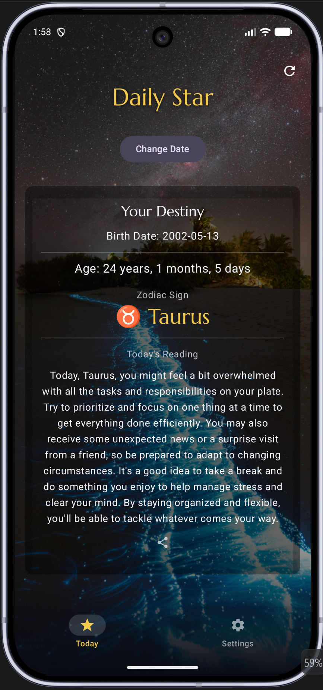
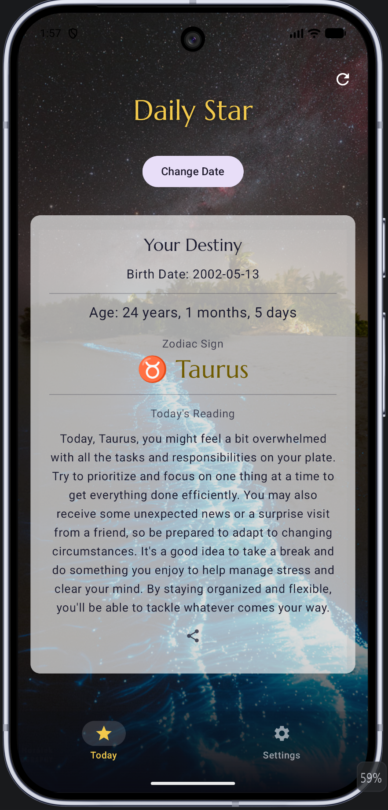

# Daily Star

A daily-companion Android app: set your birth date **once**, then open the app any day to see **today's** age, your **zodiac sign**, and a **live daily horoscope** — all set against a fresh **NASA astronomy photo of the day**.

Built for **CP3406 Mobile Computing — Assignment 1 (Utility App)** at James Cook University.

## Screenshots

| Today (dark) | Today (light) | Settings |
|---|---|---|
|  |  |  |

## Features

- **At-a-glance daily value** — pick your birth date once and the Today screen shows your current age (years / months / days), your zodiac sign, and a fresh horoscope for the current day.
- **Two live APIs** — the daily reading is fetched from a public horoscope API, and the full-screen background is NASA's [Astronomy Picture of the Day](https://apod.nasa.gov/apod/). A **shuffle** button pulls a new NASA photo on demand. Both have inline loading and error states.
- **Settings that change the screen:**
  - **Reading length** (Short / Full) — immediately changes how much of the horoscope is shown.
  - **Theme** (System / Light / Dark) — an in-app theme toggle.
- **Remembers everything** — your birth date and both settings are saved with DataStore, so they survive closing the app or even the process being killed.
- **Share** — send today's reading to any app via the system share sheet.
- **Polished, animated UI** — a custom night-sky theme, a frosted-glass "destiny" card layered over the NASA photo, an edge-to-edge layout, a custom **Marcellus** serif typeface for headings, and animated transitions between loading / error / loaded states.
- **Two-screen navigation** — a Material 3 bottom navigation bar switches between **Today** and **Settings**.

## Architecture

The app follows a layered **MVVM + Repository** architecture with dependency injection, so each layer has a single responsibility: composables never touch networking, view models never touch Compose, and each repository is the single source of truth for its data.

```
com.example.issac/
├── MainActivity.kt              // thin entry point (@AndroidEntryPoint), drives the theme
├── IssacApplication.kt          // @HiltAndroidApp
├── UtilityApp.kt                // Scaffold + edge-to-edge bottom navigation
│
├── ui/
│   ├── theme/                   // Color, Theme, Type — night-sky Material 3 theme + Marcellus
│   ├── main/
│   │   ├── MainScreen.kt        // observes MainViewModel via StateFlow
│   │   ├── MainViewModel.kt     // @HiltViewModel, holds MainUiState
│   │   ├── MainUiState.kt
│   │   └── components/          // ZodiacBadge, AgeCard, HoroscopeCard (each with @Preview)
│   └── settings/
│       ├── SettingsScreen.kt    // reading-length + theme controls
│       └── SettingsViewModel.kt
│
├── data/
│   ├── horoscope/               // HoroscopeApi (Retrofit), HoroscopeRepository, dto/
│   ├── apod/                    // ApodApi (Retrofit), ApodRepository, dto/ — NASA photo
│   └── settings/
│       ├── ReadingLength.kt
│       ├── ThemeMode.kt
│       └── SettingsRepository.kt // settings state, backed by DataStore
│
├── domain/
│   ├── model/                   // Horoscope, Zodiac
│   └── usecase/DetermineZodiacUseCase.kt  // pure, unit-tested function
│
└── di/
    ├── NetworkModule.kt         // Retrofit / OkHttp / Json for both APIs
    └── DataStoreModule.kt       // Preferences DataStore
```

**Data flow:** `MainScreen` → observes `StateFlow<MainUiState>` from `MainViewModel` → calls `HoroscopeRepository` / `ApodRepository` → calls the Retrofit APIs → external services. Settings flow reactively from `SettingsRepository` (DataStore) into the view models. All wiring is provided by Hilt.

## Tech stack

- **Kotlin**
- **Jetpack Compose** — declarative UI, reusable composables, `@Preview`s, animations (`AnimatedContent`, `AnimatedVisibility`, `animateContentSize`)
- **Material 3** — theming, `NavigationBar`, segmented buttons, edge-to-edge
- **MVVM** — `ViewModel` + `StateFlow`, lifecycle-aware collection (`collectAsStateWithLifecycle`)
- **Hilt** — dependency injection
- **Retrofit** + **kotlinx.serialization** — networking and JSON parsing for two APIs
- **Coil** — asynchronous image loading for the NASA background
- **DataStore (Preferences)** — persisting birth date and settings across restarts
- **Kotlin Coroutines / Flow** — asynchronous work and reactive state

## Testing

JUnit unit tests cover the core logic across layers:

- `DetermineZodiacUseCaseTest` — zodiac determination
- `HoroscopeResponseTest` / `ApodResponseTest` — JSON parsing of the API responses
- `HoroscopeRepositoryTest` / `ApodRepositoryTest` — API-to-domain mapping (with fake APIs)
- `MainViewModelTest` — state updates and horoscope loading
- `SettingsRepositoryTest` — settings persistence (with an in-memory fake DataStore)
- `ReadingLengthTest` — short/full formatting

Run them with `./gradlew :app:testDebugUnitTest`.

## Build & run

1. Open the project in **Android Studio** (Koala or newer recommended).
2. Let **Gradle** sync.
3. Run on an emulator or physical device (requires an internet connection for the live horoscope and NASA photo).

**Optional — your own NASA key:** the app works out of the box using NASA's shared `DEMO_KEY`, which has a low hourly rate limit. To use a personal key (free from [api.nasa.gov](https://api.nasa.gov/)), add this line to `local.properties` (which is gitignored):

```
nasa.apiKey=YOUR_KEY_HERE
```

## Attribution

- Daily horoscope data: the free **[Free Horoscope API](https://freehoroscopeapi.com/)** (no API key required).
- Background imagery: **[NASA Astronomy Picture of the Day](https://apod.nasa.gov/apod/)** via [api.nasa.gov](https://api.nasa.gov/).
- Heading typeface: **Marcellus** by Astigmatic, licensed under the [SIL Open Font License 1.1](FONT_LICENSE.txt).

## Author

**Bo Yuan** ([@Yuanbo111](https://github.com/Yuanbo111))

## License

Created as coursework for CP3406 Mobile Computing at James Cook University. For educational use.
